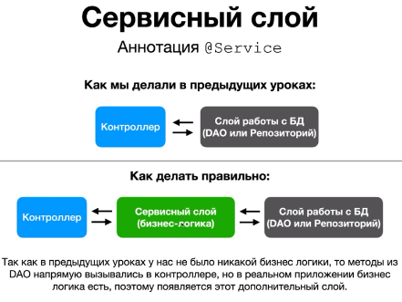
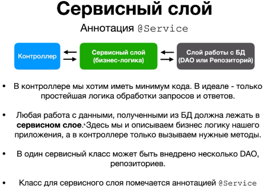

#### Spring Data JPA, самый абстрактный и самый простой способ работы с БД.

1. До этого, когда мы реализовывали работу с БД, мы её реализовывали в специальном классе который
   называется `DAO с Hibernate`
2. Теперь мы перейдём с **DAO** на **Spring Data JPA**

##### DAO vs Репозиторий (`@Repository`)

* Репозиторий обычно более высокоуровневый, ближе к бизнес логики (не пишем SQL запросы, работаем с сущностями.)
* DAO обычно более низкоуровневый, ближе к БД (можем писать SQL запросы)
  * В сложных приложениях обычно есть и то и другое:
    1. `Репозиторий` - для стандарных операций с данными (CRUD например).
    2. `DAO` - для более сложных манипуляций с данными с БД где обычно нужно вручную писать SQL. 

##### Сервисный слой (`@Service`)

